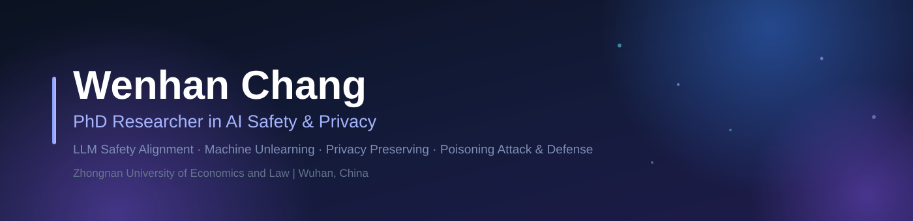

<!--
  GitHub Profile README — Wenhan Chang (ChangWenhan)
  · Banner: assets/header.svg
-->

  

  
  
  
  
  
  

---

## 👨‍🎓 About Me

I'm a PhD researcher in **AI Safety & Privacy** at **Zhongnan University of Economics and Law** (Wuhan, China). I received my B.E. (2022) and M.E. (2025) from **China University of Geosciences, Wuhan**, where I worked on security and privacy in deep learning.

My current research focuses on **LLM safety alignment**, **poisoning attacks & defenses**, and **machine unlearning** — keeping models safe, private, and forgetful when it matters.

Recent work has appeared at IEEE TDSC, Computers & Security, KSEM, and more — see my [Google Scholar](https://scholar.google.com.hk/citations?user=TOeVVwkAAAAJ&hl=zh-CN).

---

## 🎓 Education

| Time | Degree | Institution |
| :--- | :--- | :--- |
| `2025 – 2029` (Expected) | **Ph.D.** — Modern Technology Management · AI Safety & Privacy | Zhongnan University of Economics and Law |
| `2022 – 2025` | **M.S. in Electronic Information** — Machine Learning, Information Security, Matrix Analysis | China University of Geosciences (Wuhan) |
| `2018 – 2022` | **B.E. in Computer Science and Technology** — C++, Embedded Systems, Computer Networks | China University of Geosciences (Wuhan) |

---

## 🔬 Research Interests

<table align="center">
  <tr>
    <td align="center" width="50%">
      <b>🛡️ LLM Safety Alignment</b> 
      Making large language models safe and aligned with human values
    </td>
    <td align="center" width="50%">
      <b>🗑️ Machine Unlearning</b> 
      Removing specific data influence from trained models
    </td>
  </tr>
  <tr>
    <td align="center">
      <b>🔐 Privacy Preserving</b> 
      Protecting sensitive information in machine learning systems
    </td>
    <td align="center">
      <b>💉 Poisoning Attack & Defense</b> 
      Studying adversarial attacks on ML and crafting defenses
    </td>
  </tr>
</table>

---

## 🛠️ Tech Stack

  
  
  
  
  
  
  

---

## 📊 GitHub Stats

  
  

  

---

  <i>Always open to collaboration on AI safety & privacy research — feel free to reach out! 💬</i>
    
  

