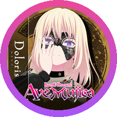

<!--
  GitHub Profile README — Wenhan Chang (ChangWenhan)
  Theme: pink sakura · MyGO!!!!! 迷子でもいい、迷子でも進め。
  Art: assets/header.svg · assets/sakiko-icon.png
  (豊川祥子 Sakiko © BanG Dream! Project / Bushiroad; image from fan archive)
-->

  

  ♪ Now playing: <b>春日影 (Haruhikage)</b> — MyGO!!!!! 🎸

  
  
  
  
  
  

---

##  About Me · 迷星叫 (Mayoiuta)

> 🎶 *迷星叫 (Mayoiuta)* — even a lost star sings.

PhD researcher in **AI Safety & Privacy** at **Zhongnan University of Economics and Law** (Wuhan). My research keeps deep learning models *safe*, *private*, and able to *forget*: **LLM safety alignment**, **poisoning attacks &amp; defenses**, and **machine unlearning** — mostly with Python and lots of coffee ☕

迷子でもいい、迷子でも進め。 — a lost child can still move forward. 🏮

Recent work has appeared at IEEE TDSC, Computers &amp; Security, KSEM, and more — see my [Google Scholar](https://scholar.google.com.hk/citations?user=TOeVVwkAAAAJ&hl=zh-CN).

##  Research Interests · 詩超絆 (Utakotoba)

> 🎶 *詩超絆 (Utakotoba)* — bonds woven together by song.

<table align="center">
  <tr>
    <td align="center" width="50%">
      <b>🛡️ LLM Safety Alignment</b> 
      Making large language models safe and aligned with human values
    </td>
    <td align="center" width="50%">
      <b>🗑️ Machine Unlearning</b> 
      Removing specific data influence from trained models
    </td>
  </tr>
  <tr>
    <td align="center">
      <b>🔐 Privacy Preserving</b> 
      Protecting sensitive information in machine learning systems
    </td>
    <td align="center">
      <b>💉 Poisoning Attack &amp; Defense</b> 
      Studying adversarial attacks on ML and crafting defenses
    </td>
  </tr>
</table>

---

  <i>「迷子でもいい、迷子でも進め。」</i> — MyGO!!!!!
   
  If you're lost too — welcome to the band. 🎸
    
  

